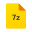

# Config for [GlazeWM](https://github.com/glzr-io/glazewm) and [Zebar](https://github.com/glzr-io/zebar)


for 1080p resolution, bar height is 32px on 125% system scale

## Zebar Features:
#### Left:
- **Windows button** - opens Start Menu using VBScript
- **Search button** - opens windows Search using AHK
- **Workspaces buttons** - from GlazeWM
- **Tiling direction** - from GlazeWM
- **Binding mode status** - from GlazeWM
#### Center:
- **Opened Apps** - show application icons running on **displayed workspaces** from GlazeWM using Icons8<br>
  
  
  
  
  
  
  
  
  
  
  
  
  
  
  
  
  
  
  
  
  
  
  
  
  
  
  
  
  
  
  
  
  
  
#### Right:
- **Spotify Status** - shows currently playing song from Spotify app title (refresh only on workspace change)
- **CPU status button** - shows Cpu usage, opens System Informer (refresh every 2s)
- **Memory Stats button** - shows Memory usage and when hovering used and total memory in GB, opens Mem Reduct (refresh every 4s)
- **Weather status** - shows weather icon and temperature in Celsius (refresh every 1h)
- **Network status** - shows wifi or ethernet icon, download and upload speed in Bytes, opens action center using AHK (refresh every 2s)
- **Battery status** - shows battery icon and actual percentage charge (refresh every 10s)
- **Time status** - shows actual time in format 'HH:mm', opens notification panel


## Used
Font: **CaskaydiaMono Nerd Font** <br>
https://www.nerdfonts.com/font-downloads

Icons: **Icons8** <br>
https://icons8.com/icons

Scripts: **AutoHotkey**, **VBScript** (in the system) <br>
https://www.autohotkey.com

Cpu button open [System Informer](https://systeminformer.sourceforge.io/) 

Memory button open [Mem Reduct](https://github.com/henrypp/memreduct)


## Instalation
If you don't want to make any modifications then download from the [releases](https://github.com/iAttaquer/.glzr/releases), but if you want to modify
you have two versions. <br>One is in react and need internet to run `zebar/attaquer-buildless` and second in solid-js `zebar/attaquer-solid-ts`. This version need to be build.
Download and install [Node.js](https://nodejs.org/en/download/prebuilt-installer).
Go to the `attaquer-solid-ts` directory:
```shell
cd ~/.glzr/zebar/attaquer-solid-ts
```
install modules:
```shell
npm install
```
build:
```
npm run build
```
Now you can activate widget using tray icon.

You also need to download [AutoHotkey](https://www.autohotkey.com/) to be able to use search and network buttons.
#### Quick installation of Ahk using the console:
```
winget install AutoHotkey.AutoHotkey
```
#### Instead of **System Informer** you probably want to use **Task Manager**. <br>
In the `zebar/attaquer-solid-ts/src/CpuStatus/CpuStatus.tsx` or `zebar/attaquer-buildless/index.jsx`:
```js
{output.cpu && (
    <button className={`cpu ${getCpuUsageRate(output.cpu)}`}
      onClick={() =>{
        output.glazewm.runCommand('shell-exec %ProgramFiles%/SystemInformer/SystemInformer.exe');
      }}>
        <span className="content">
          <span className="i-cpu">
            
          </span>
          <span className="cpu-bar">
            {Math.round(output.cpu.usage)}%
          </span>
        </span>
    </button>
)}
```
change this: ```%ProgramFiles%/SystemInformer/SystemInformer.exe``` <br>
to this: ```%windir%/system32/taskmgr.exe /7```
